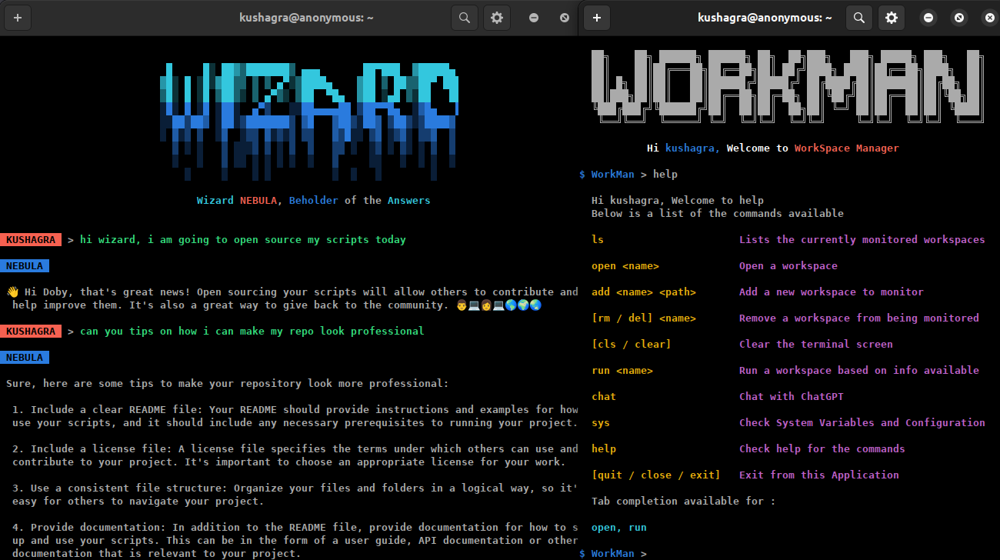

This repository contains all the tools I custom made using python Cmd. Open-Sourcing these for anyone to customize and use depending on personal requirements. However, I've attached a setup file to make it easier, the process of configuring the system to be ready for using a tool among these.

# List of Tools

- **WorkMan (WorkSpace Manager)**
- **Wizard (OpenAI ChatBots)**

# Latest Features

- Added Chat History feature to Wizard.
Can be accessed using the commands, `cload`, `csave` and `crm`
- Bug fixes

# Setup

> Make sure to have latest version of Python and Pip installed in your system. To begin with the Setup process

1. Clone the repository in your system using the command 
```bash
git clone https://github.com/developer-kush/CLI_Tools.git 
```

2. Run the `setup.py` file in the repository and follow instructions to setup the storage  directories in your system, and install the required packages as well.
> NOTE : you might lose your data if you re-run `setup.py` it will be installed from the begining

3. If you're using Linux like me, you can make an alias for running the script using python,
In other case, if you're using Windows, you may prefer installing it using `pyinstaller` or run scripts directly using python3. 

# Contribution

This is the initial commit, and there still are issues that needs to be addressed. If you're facing any of them, feel free to raise them in the issues section.

If you like, you may contribute by implementing fixes and features and issuing a pull request.